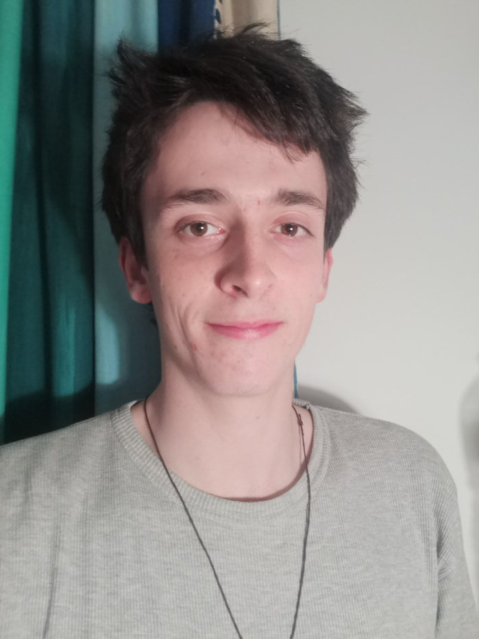

I am a Ph.D. candidate at Sorbonne University, LIP6, my thesis advisor is Dominique Béréziat with Anastase Charantonis as co-supervisor. I study deep learning methods to reconstruct satellite data of the ocean surface with a particular focus on sea surface height and temperature. 
 
Contact: <a href="mailto:theo.archambault@lip6.fr">theo.archambault@lip6.fr</a> , <a href="https://www.researchgate.net/profile/Theo-Archambault" target="_blank">Research Gate</a>,  <a href="https://www.semanticscholar.org/author/Th%C3%A9o-Archambault/1387907072" target="_blank">Semantic Scholar</a>, <a href="https://scholar.google.com/citations?user=Lb0HoBkAAAAJ&hl=fr" target="_blank">Google Scholar</a>

# Publications

## Journal

Archambault, T., Filoche, A., Charantonis, A.A., Béréziat, D., & Thiria, S. (2024). *Learning Sea Surface Height Interpolation From Multi-Variate Simulated Satellite Observations*. Journal of Advances in Modeling Earth Systems (JAMES). <a href="https://agupubs.onlinelibrary.wiley.com/doi/full/10.1029/2023MS004047" target="_blank"> link </a>, <a href="https://github.com/theoarchambault/theoarchambault.github.io/blob/main/articles/JAMES2024.pdf" target="_blank"> file </a> 

Thiria, S., Sorror, C., Archambault, T., Charantonis, A.A., Béréziat, D., Mejia, C., Molines, J.M., & Crépon, M. (2023). *Downscaling of ocean fields by fusion of heterogeneous observations using Deep Learning algorithms*. Ocean Modelling. <a href="https://www.sciencedirect.com/science/article/pii/S146350032300015X?via%3Dihub" target="_blank"> link </a> (ask me the file in an email)

Archambault, T., Charantonis, A.A., Béréziat, D., Mejia, C., & Thiria, S. (2022). *Sea surface height super-resolution using high-resolution sea surface temperature with a subpixel convolutional residual network*. Environmental Data Science. <a href="https://www.cambridge.org/core/journals/environmental-data-science/article/sea-surface-height-superresolution-using-highresolution-sea-surface-temperature-with-a-subpixel-convolutional-residual-network/D63D5B6E5A7DEF18D8743E6CCD4D5FBC" target="_blank"> link </a>, <a href="https://github.com/theoarchambault/theoarchambault.github.io/blob/main/articles/EDS2022.pdf" target="_blank"> file </a> 

## Conference

Archambault, T., Filoche, A., Charantonis, A., & Béréziat, D. (2024). *Pre-training and Fine-tuning Attention Based Encoder Decoder Improves Sea Surface Height Multi-variate Inpainting*. VISAPP. <a href="https://doi.org/DOI: 10.5220/0012357400003660" target="_blank"> link </a>, <a href="https://github.com/theoarchambault/theoarchambault.github.io/blob/main/articles/VISAPP2024.pdf" target="_blank"> file </a> 

Archambault, T., Filoche, A., Charantonis, A.A., & Béréziat, D. (2023). *Multimodal Unsupervised Spatio-Temporal Interpolation of Satellite Ocean Altimetry Maps*. VISAPP.<a href="https://www.scitepress.org/Link.aspx?doi=10.5220/0011620100003417" target="_blank"> link </a> , <a href="https://github.com/theoarchambault/theoarchambault.github.io/blob/main/articles/VISAPP2023.pdf" target="_blank"> file </a> 

Filoche, A., Archambault, T., Charantonis, A.A., & Béréziat, D. (2022). *Statistics-Free Interpolation of Ocean Observations with Deep Spatio-Temporal Prior*. ECML MACLEAN workshop. <a href="https://www.semanticscholar.org/paper/Statistics-Free-Interpolation-of-Ocean-Observations-Filoche-Archambault/48fe4b7da62991ebc1cf0328c5b349b37fe9c776" target="_blank">link </a>, <a href="https://github.com/theoarchambault/theoarchambault.github.io/blob/main/articles/ECML_MACLEAN2022.pdf" target="_blank"> file </a> 

Archambault, T. ,Filoche, A., Charantonis, A.A., & Béréziat, D. (2022). *Unlearned Downscaling of Sea Surface Height with Deep Image Prior. ICLR AI for Earth Science Workshop*. <a href="https://hal.sorbonne-universite.fr/hal-03659040/document" target="_blank">link </a>, <a href="https://github.com/theoarchambault/theoarchambault.github.io/blob/main/articles/AI4ES_ICLR2022.pdf" target="_blank"> file </a> 

Archambault, T., Charantonis, A., Béréziat, D., & Thiria, S. (2022). *SSH Super-Resolution using high resolution SST with a Subpixel Convolutional Residual Network*. Climate Informatics. <a href="https://www.semanticscholar.org/paper/Sea-surface-height-super-resolution-using-sea-with-Archambault-Charantonis/3784e709ef4b5301e33bbfe119b91c1c7acd0204" target="_blank">link </a>, <a href="https://github.com/theoarchambault/theoarchambault.github.io/blob/main/articles/CI2021.pdf" target="_blank"> file </a> 

## Preprint 

Archambault, T., Filoche, A., Charantonis, A.A., Béréziat, D., & Thiria, S. (2023). *Unsupervised Learning of Sea Surface Height Interpolation from Multi-variate Simulated Satellite Observations*. ArXiv, abs/2310.07626. <a href="https://essopenarchive.org/users/670252/articles/670372-unsupervised-learning-of-sea-surface-height-interpolation-from-multi-variate-simulated-satellite-observations" target="_blank"> link </a>, <a href="https://github.com/theoarchambault/theoarchambault.github.io/blob/main/articles/JAMES2023_preprint.pdf" target="_blank"> file </a> 

# Presentations

## In conferences

EGU 2024: Oral presentation (on site): <a href="https://github.com/theoarchambault/theoarchambault.github.io/blob/main/presentations/EGU2024.pdf" target="_blank"> slides </a> , <a href="https://github.com/theoarchambault/theoarchambault.github.io/blob/main/abstract/EGU24-17465-print.pdf" target="_blank"> abstract </a> 

VISAPP 2024: Oral presentation (on site): <a href="https://github.com/theoarchambault/theoarchambault.github.io/blob/main/presentations/VISAPP2024.pdf" target="_blank"> slides </a> 

VISAPP 2023: Poster presentation (on site): <a href="https://github.com/theoarchambault/theoarchambault.github.io/blob/main/posters/VISAPP2023_poster.pdf" target="_blank"> poster </a> 

RFIAP 2022: Poster presentation (on site): <a href="https://github.com/theoarchambault/theoarchambault.github.io/blob/main/posters/RFIAP_poster.pdf" target="_blank"> poster </a>. It is an accepted resubmission of my work in Climate informatics 2022.

Climate Informatics 2022: Oral presentation (online): <a href="https://github.com/theoarchambault/theoarchambault.github.io/blob/main/presentations/CI2022.pdf" target="_blank"> slides </a>. 

## In seminar and study groups
Formal-v2 launch day 2024 : Oral presentation (on site): <a href="https://iscd.sorbonne-universite.fr/formal-scientific-day-2024/" target="_blank"> link </a> <a href="https://github.com/theoarchambault/theoarchambault.github.io/blob/main/presentations/FORMAL_2024.pdf" target="_blank"> slides </a> 

Telecom Paris Seminar 2023: Oral presentation (on site): <a href="https://github.com/theoarchambault/theoarchambault.github.io/blob/main/presentations/Seminar2024.pdf" target="_blank"> slides </a> 

Formal-v2 launch day 2023 : Poster presentation (on site): <a href="https://iscd.sorbonne-universite.fr/formal-v2-kick-off-march-21st-2023/" target="_blank"> link </a> 

SAMA/SCAI study group 2022: Oral presentation (on site): <a href="https://github.com/theoarchambault/theoarchambault.github.io/blob/main/presentations/SAMA2022.pdf" target="_blank"> slides </a> 

